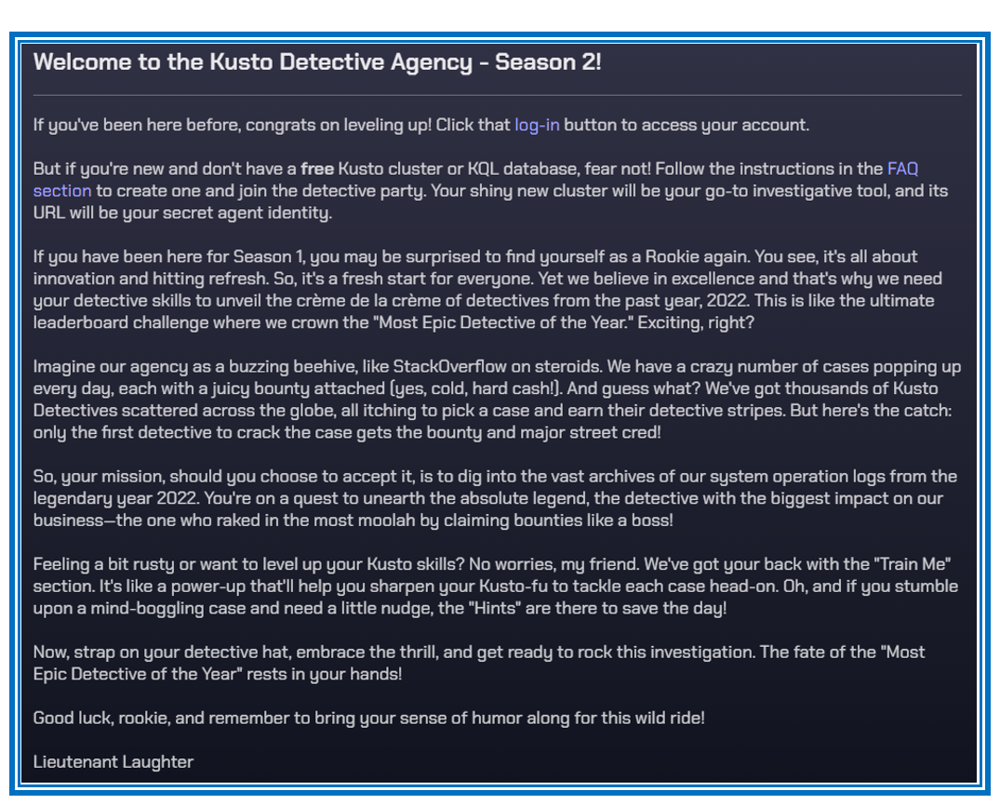
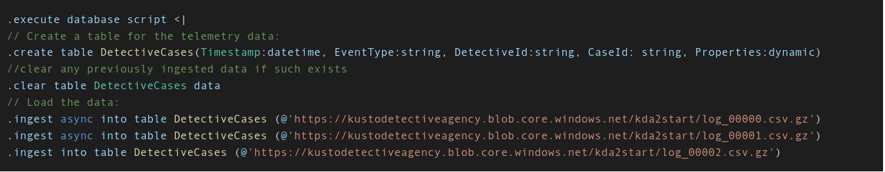

<p align="center">

</p>

- [Introduction](#introduction)
- [Mystery Question](#mystery-question)
- [Answer](#answer)
  - [Part 1 : Importing data](#part-1--importing-data)
  - [Part 2 : Exploration detective mystery](#part-2--exploration-detective-mystery)


## Introduction

Welcome to the intriguing world of mystery detective practice, where the art of **solving crimes merges with the power of data analysis**. 

In this captivating journey, I will explore the fusion of detective work with MySQL operations, unraveling mysteries through the lens of structured query language (SQL). 

As a mystery detective,My mission is to crack complex cases, glue together clues, and identify culprits. 
In today's digital age, the vast amount of information can be overwhelming. That's where MySQL comes in, **serving as your trusty partner in organizing and analyzing data** to uncover hidden connections and patterns.

Using MySQL I have stored and  investigated data.

I'll be extracting relevant data, cross-reference evidence, and identify leads that can bring you closer to solving the case.


## Mystery Question

<p align="center">

</p>

Here is the question : 

<p align="center">

</p>

Here is the KQL query for creating the relevant tables:


<p align="center">

</p>

I have downloaded the files and solved the mystery in both Mysql and Python approaches:

## Answer
### Part 1 : Importing data

```sql
# enca -L none log_00000_new.csv
# sed 's/\r//' log_00000.csv > log_00000_new.csv

show tables;
use Kusto_Detective_season2;
show variables like "secure_file_priv";
show variables like "local_infile";

drop table DetectiveCases;

CREATE TABLE DetectiveCases (
Time_stamp datetime,
    EventType TEXT,
    DetectiveId TEXT ,
    CaseId TEXT,
    Properties json
);


# Works well:
# replace "" to {}

-- Here below I am adding and dumping the 3 csv files into the DetectiveCases table: 
#LOAD DATA INFILE '/var/lib/mysql-files/log_00000_new.csv'
#LOAD DATA INFILE '/var/lib/mysql-files/log_00001_new.csv'
LOAD DATA INFILE '/var/lib/mysql-files/log_00002_new.csv'

INTO TABLE DetectiveCases
FIELDS TERMINATED BY ','
ENCLOSED BY '"'
LINES TERMINATED BY '\n'
(Time_stamp, EventType,DetectiveId, CaseId, @Properties)
SET Properties = JSON_SET('{}', '$.Bounty', JSON_EXTRACT(@Properties, '$.Bounty'));


select * from DetectiveCases
limit 500;
```

### Part 2 : Exploration detective mystery

```sql
use Kusto_Detective_tasks;

-- Creating temporary table:
-- 1) TEMPORARY TABLE all_case_solved_by_detective
-- 2) TEMPORARY TABLE temp_table_for_bounty
-- 3) TEMPORARY TABLE temp_table_for_case_solved
-- 4) TEMPORARY TABLE temp_table_detective_before_final_join
-- 5) TEMPORARY TABLE temp_table_after_partition
-- 6) TEMPORARY TABLE temp_table_detective_after_final_join


-- Drop temporary table:
drop table all_case_solved_by_detective;
drop table temp_table_for_bounty;
drop table temp_table_detective_before_funal_join;
drop table temp_table_after_partition;
drop table temp_table_detective_after_final_join;
```

```sql
-- Step Num 1 : Creating table number 1 - all_case_solved_by_detective

drop table all_case_solved_by_detective;

CREATE TEMPORARY TABLE all_case_solved_by_detective AS
Select Time_stamp ,EventType,  CaseId , DetectiveId
from DetectiveCases
WHERE EventType = 'CaseSolved'
order by CaseId;
```

```sql
-- Step Num 1 : extracting the bounty value from the properties in order to count the sum of bounties, filtering rows which satisfied the constraint where EventType = 'CaseOpened'

SELECT  EventType , CaseId , JSON_EXTRACT(Properties, '$.Bounty') AS bounty_value
FROM DetectiveCases
WHERE EventType = 'CaseOpened';


select *
from all_case_solved_by_detective;
```

```sql
-- Step Num 2 : Create a temporary table named 'temp_table_for_bounty'

drop table temp_table_for_bounty;

CREATE TEMPORARY TABLE temp_table_for_bounty AS
SELECT  EventType , CaseId , JSON_EXTRACT(Properties, '$.Bounty') AS bounty_value
FROM DetectiveCases
WHERE EventType = 'CaseOpened'
ORDER BY bounty_value DESC;

Select *
from temp_table_for_bounty;
```

```sql
-- Step Num 3 : Create a temporary table named 'temp_table_for_case_solved'

-- In this query I managed to for each caseId to retrieve the smallest value of a time_stamp

drop table temp_table_for_case_solved;

CREATE TEMPORARY TABLE temp_table_for_case_solved AS
SELECT MIN(Time_stamp) AS first_CaseSolved, CaseId
FROM DetectiveCases
WHERE EventType = 'CaseSolved'
GROUP BY CaseId ;

select *
from temp_table_for_case_solved;
```

```sql
-- Step Num 4 : Create a temporary table named 'temp_table_detective_before_final_join'
-- I joined the 2 tables: temp_table_for_case_solved and  all_case_solved_by_detective
-- in order to add the DetectiveId who solved the case for the first time, before the others.
-- The result will be the intersection of data from both tables (temp_table_for_case_solved and  all_case_solved_by_detective ), including only rows that have matching time_stamp and case_Id values in both temp_table_for_case_solved and all_case_solved_by_detective.


drop table temp_table_detective_before_funal_join;

CREATE TEMPORARY TABLE temp_table_detective_before_final_join AS
SELECT temp_table_for_case_solved.first_CaseSolved,
       all_case_solved_by_detective.EventType,
       temp_table_for_case_solved.CaseId,
       all_case_solved_by_detective.DetectiveId
FROM temp_table_for_case_solved
INNER JOIN all_case_solved_by_detective
ON temp_table_for_case_solved.first_CaseSolved = all_case_solved_by_detective.Time_stamp AND
   temp_table_for_case_solved.CaseId = all_case_solved_by_detective.CaseId;
   
select *
from temp_table_detective_before_final_join;
```

```sql
--Step Num 5 :Here I used PARTITION in order to retrieve the rows with the DetectiveId with the smaller number ID

drop table temp_table_after_partition;

CREATE TEMPORARY TABLE temp_table_after_partition AS
SELECT *                                             # The outer query gives us the first row of each group
FROM (SELECT *, ROW_NUMBER() OVER (PARTITION BY
     caseId ORDER BY DetectiveId) AS row_number1
     FROM temp_table_detective_before_final_join) AS t
WHERE t.row_number1 = 1
order by first_CaseSolved, DetectiveId asc;


select *
from temp_table_after_partition;

```


```sql
--Step Num 6 : Final_join ( between temp_table_after_partition & temp_table_for_bounty)

drop table temp_table_detective_after_final_join;

CREATE TEMPORARY TABLE temp_table_detective_after_final_join AS
Select temp_table_after_partition.DetectiveId , temp_table_for_bounty.bounty_value , temp_table_for_bounty.CaseId
from temp_table_after_partition
inner join temp_table_for_bounty
On temp_table_after_partition.CaseId = temp_table_for_bounty.CaseId
order by temp_table_after_partition.DetectiveId DESC;

select *
from temp_table_detective_after_final_join;
```

```sql
-- Step Num 7 - Last step: Grouping in order to get to the sum of bounty for each detectiveselect

select sum(bounty_value) as sum_bounty_value , DetectiveId
from temp_table_detective_after_final_join
group by DetectiveId
order by  sum_bounty_value DESC ;
```


```sql
-- Step Num 8 : Dropping the temporary tables
DROP TABLE IF EXISTS all_case_solved_by_detective;
DROP TABLE IF EXISTS temp_table_for_bounty;
DROP TABLE IF EXISTS temp_table_for_case_solved;
DROP TABLE IF EXISTS temp_table_detective_before_final_join;
DROP TABLE IF EXISTS temp_table_after_partition;
DROP TABLE IF EXISTS temp_table_detective_after_final_join;
```


